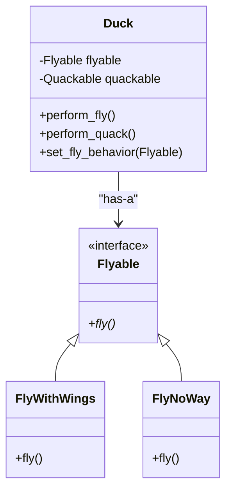

# Strategy Design Pattern: A Comprehensive Guide

The **Strategy Pattern** is a behavioral design pattern that allows you to define a family of algorithms, encapsulate each one in a separate class, and make them interchangeable. It lets the algorithm vary independently from the clients that use it.

---

## 1. Core Motivation
In software design, some parts of an application "stay the same" while others "change frequently." If you hardcode the changing parts (like how a duck flies) into the parts that stay the same (like the concept of a Duck), your system becomes rigid and hard to maintain.

The Strategy Pattern advocates for **Identifying what varies and encapsulating it.**

---

## 2. Key Design Principles

### A. Encapsulate what varies
Identify the parts of your application that change often and separate them from what stays the same.

### B. Program to an interface, not an implementation
Instead of a `Duck` class having a method like `fly_with_wings()`, it should have a reference to an interface `FlyBehavior`. The duck doesn't care *how* it flies; it only cares that it *can* fly.

### C. Favor composition over inheritance
"Has-A" is often better than "Is-A." A Duck `Has-A` fly behavior rather than `Is-A` flying duck. This provides much more flexibility.

---

## 3. Pattern Architecture

### Participants
1.  **Strategy (Interface)**: The common interface for all supported algorithms. In our code, this is `Flyable` or `Quackable`.
2.  **Concrete Strategy**: The specific implementation of the algorithm (e.g., `FlyWithWings`, `FlyNoWay`).
3.  **Context**: The class that maintains a reference to a Strategy object (e.g., `Duck`).

### Architecture Diagram


---

## 4. Why Use Strategy Instead of Inheritance? (The "V1" Problem)

In the initial `v1.py` implementation, we used inheritance. Here's why that failed:
- **Code Duplication**: Many ducks share the same "can't fly" logic, but we had to override it in every one.
- **Incorrect Behavior**: Every time we added a new duck (like `WoodenDuck`), we had to remember to override `fly()`. If we forgot, we got a flying wooden duck!
- **Runtime Rigidity**: You cannot change a parent class at runtime.

---

## 5. Runtime Flexibility: The "Superpower"

One of the greatest benefits of the Strategy Pattern is the ability to change behavior while the program is running.

```python
# In the Duck class, we can add:
def set_fly_behavior(self, new_flyable: Flyable):
    self.flyable = new_flyable

# Usage:
mallard = MallardDuck()
mallard.perform_fly()  # "I'm flying with wings"

# Oh no! The duck got injured!
mallard.set_fly_behavior(FlyNoWay())
mallard.perform_fly()  # "I can't fly"
```

---

## 6. Real-World Use Cases

| Scenario | Strategy Interface | Concrete Strategies |
| :--- | :--- | :--- |
| **Payment Options** | `PaymentStrategy` | CreditCard, PayPal, Bitcoin, ApplePay |
| **Data Compression** | `CompressionStrategy` | ZIP, GZIP, RAR, 7z |
| **Image Filters** | `FilterStrategy` | BlackAndWhite, Sepia, Blur, Vintage |
| **Navigation** | `RouteStrategy` | FastestRoute, ShortestRoute, NoTolls |

---

## 7. Pros and Cons

### Pros
- **OCP Compliance**: You can add new strategies without changing the context.
- **Isolates Detail**: Algorithm logic is separated from the main business logic.
- **Cleaner Code**: Eliminates massive `if-elif-else` or `switch` blocks.

### Cons
- **Class Explosion**: You might end up with many small classes for every little behavior.
- **Client Knowledge**: The client code must be aware of the different strategies to choose the right one.
- **Overkill**: Not needed if you only have one or two behaviors that never change.
